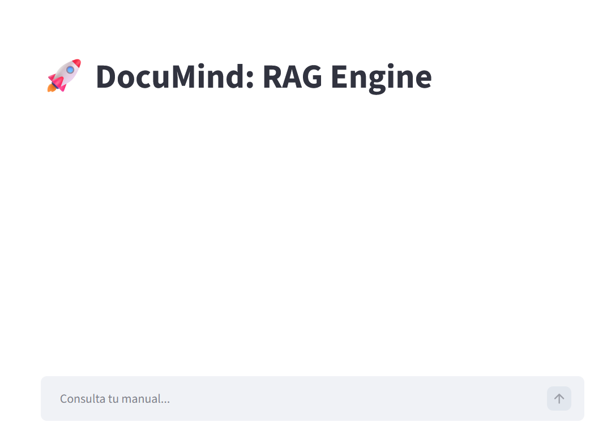
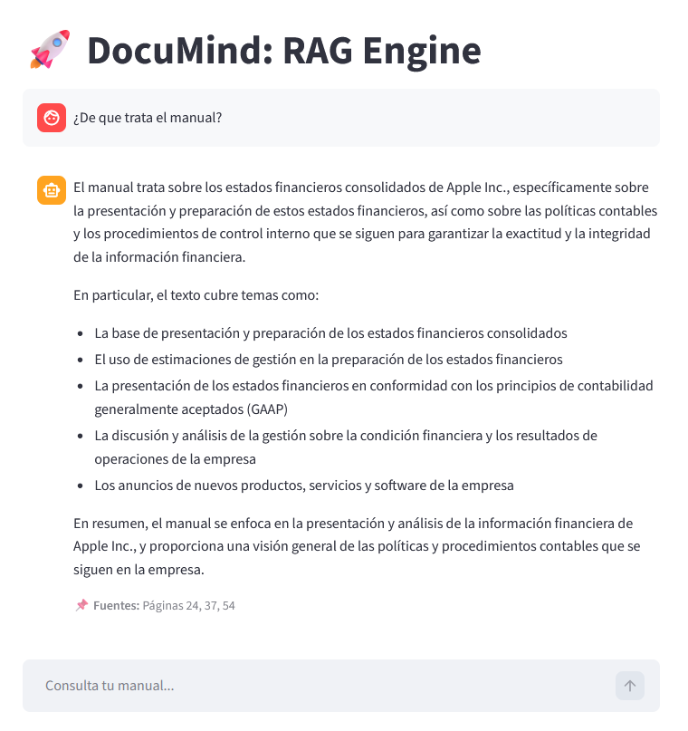

#    

# 🤖 DocuMind: High-Performance RAG Assistant

**DocuMind** is a state-of-the-art **Retrieval-Augmented Generation (RAG)** solution designed to enable private, context-aware conversations with PDF documents. By leveraging a local vectorized knowledge base, the system bypasses traditional LLM context window limits, delivering highly accurate responses grounded strictly in your provided data.

---

## 📸 App Showcase

| Main Chat Interface | Contextual Source Attribution |
|:---:|:---:|
|  |  |

---

## 🏗️ Architecture & Data Flow

The project implements a robust two-stage AI pipeline:

### 1. Ingestion Pipeline (`ingest.py`)
* **Data Extraction:** Utilizes `PyPDFLoader` to parse text and preserve page-level metadata.
* **Semantic Chunking:** Employs `RecursiveCharacterTextSplitter` (1000 char size / 150 char overlap).
* **Vectorization:** Local embedding generation using the `all-MiniLM-L6-v2` transformer model.
* **Storage:** High-speed vector indexing and persistence via **ChromaDB**.

### 2. Inference Engine (`app.py`)
* **Orchestration:** Built on **LCEL (LangChain Expression Language)** using a declarative pipe-based (`|`) architecture.
* **Retrieval:** Semantic search identifies the top-K most relevant segments.
* **Generation:** Context injection into **Llama 3.3 (70B)** via Groq’s LPU for near-instant inference.

---

## 🛠️ Tech Stack

* **Framework:** LangChain (Core/Community/HuggingFace)
* **Inference:** Groq Cloud (LPU-accelerated Llama 3.3)
* **Vector Store:** ChromaDB
* **Embeddings:** Sentence-Transformers (Local CPU)
* **UI/UX:** Streamlit
* **Environment:** Python 3.11+ / Dotenv

---

## ⚡ Key Engineering Features

* **Source Attribution:** Tracks and displays exact page numbers for every response, ensuring fact-checking reliability.
* **Semantic Integrity:** Overlap-aware chunking prevents context loss during document segmentation.
* **Low Latency:** Powered by Groq's hardware acceleration for millisecond-level response times.
* **Privacy-Centric:** All indexing happens locally; only the retrieved context is sent to the LLM.

---

## ⚙️ Setup & Deployment

1. **Clone & Navigate:**
   ```bash
   git clone [https://github.com/JarvinNavas/AI-Engineer-Portfolio.git](https://github.com/JarvinNavas/AI-Engineer-Portfolio.git)
   cd 01-DocuMind-RAG

   Environment Setup:
    Bash

    python -m venv .venv
    .\.venv\Scripts\activate  # Windows
    pip install -r requirements.txt

    Secrets Management:
    Create a .env file in the project root:
    Fragmento de código

    GROQ_API_KEY=your_groq_api_key_here

    Index Your Data & Run:
    Bash

    python ingest.py
    streamlit run app.py

🛠️ Troubleshooting & Engineering Insights

    Venv Portability: Resolved path corruption issues caused by directory restructuring by implementing a clean "re-provisioning" workflow.

    LCEL Migration: Successfully transitioned from legacy chains to LCEL syntax, resolving module resolution errors and enabling granular metadata control.

    Resource Optimization: Implemented @st.cache_resource to prevent redundant reloading of transformer models, significantly improving UI responsiveness.

© 2026 - Developed by Jarvin Navas | AI Engineering Portfolio.