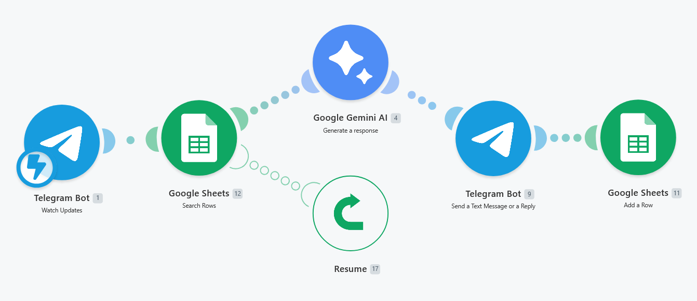
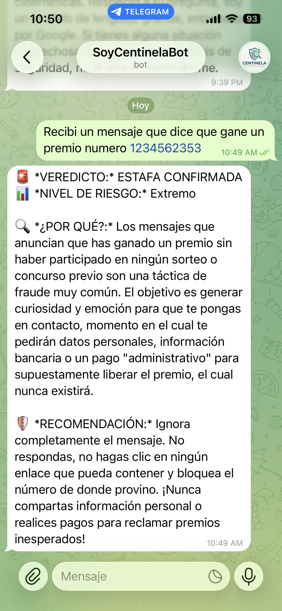

#   

# 🛡️ SafeGuard AI: Intelligent & Community-Driven Fraud Detector

**SafeGuard AI** is a security ecosystem based on a Telegram bot that leverages Artificial Intelligence to identify scams and protect citizens in real-time.

## 🚀 Try it Out!
##Live Demo: Find this bot on Telegram as @UsaCentinela.

---

## 📸 Project Showcase
| Automation Architecture | Bot Interface |
|---|---|
|  |  |

## ❤️ The "Why": AI with a Mission
This project is born from a deep personal mission. My father was a victim of financial fraud—an experience that showed me how vulnerable we can be to deceptive tactics. That event drove me to use my expertise as an **AI Engineer** to build an **Intelligent Agent** that acts as a shield for others, preventing more families from going through the same situation.

## 🔍 How the Bot Works
Users interact with the bot in a simple, direct way:
1. **Data Input:** The user sends a suspicious message text and/or a phone number.
2. **Agent Analysis:** The AI (Google Gemini) analyzes the language, tone, and structure of the message to detect fraud patterns (Phishing, Smishing, etc.).
3. **Community Reputation:** The system queries a real-time database (Google Sheets). If the number has been **reported multiple times** by other users, the bot explicitly indicates it, alerting the user to the attacker's recurrence.
4. **Verdict & Recommendations:** The bot provides a fraud probability score and offers immediate preventive advice (e.g., "Do not share OTP codes," "This link is malicious," "Block this contact immediately").

## 🏗️ System Architecture
* **User Interface:** Telegram Bot API (for high accessibility).
* **The Brain:** Google Gemini AI, configured as a cybersecurity expert.
* **Orchestration:** Make.com, managing the data flow between the AI and the database.
* **Database & Feedback Loop:** Google Sheets, serving as a historical ledger to identify reported numbers and feed the community reputation system.

## ⚡ Key Features
* **Feedback System:** Every query strengthens the community database.
* **Recurrence Indicator:** If a number has been flagged before, the system marks it as "High Risk."
* **Educational Prevention:** The bot doesn't just detect; it teaches the user what safety measures to take.

## ⚙️ How to Replicate
1. Import the `blueprint.json` file into Make.com.
2. Configure the Telegram Webhooks.
3. Connect the Google Sheets module for the reporting system.
4. Add your Google Gemini API Key.

---
© 2026 - Developed by **Jarvin Navas** | AI Solutions Architect.
